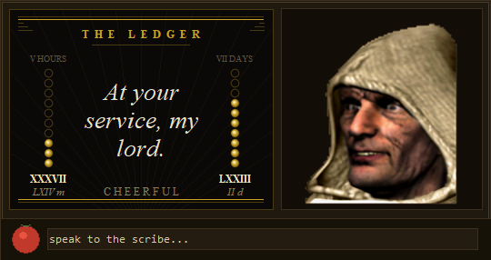
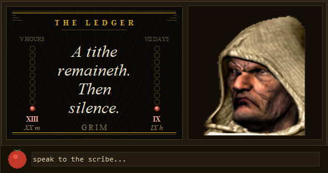
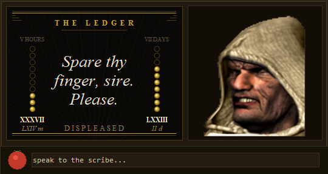
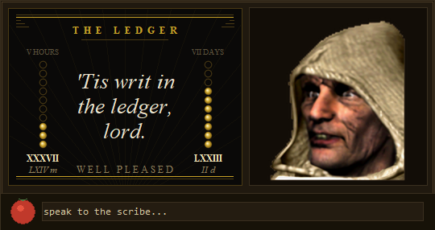
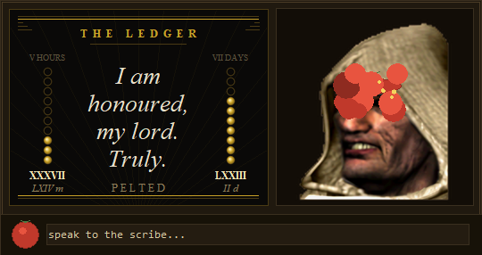

# The Scribe

**Stronghold Crusader's hooded advisor, moved onto the desktop to keep the
ledger — and to be pelted with tomatoes.**

A small always-on-top panel for Claude Code. Frameless, draggable, remembers
where you put it, including on a second monitor. Right-click or Esc closes it.



> *At rest. Seventy-three parts of the week still in the coffer, so he is
> cheerful about it.*

He floats above every window and reports two numbers Claude Code exposes nowhere
else: how much of your five-hour and seven-day allowance is left. His face tracks
the week — a broad grin at nothing spent, a stern frown near the end, and nine
faces in between. The sprite sheet from the 2002 game, decoded and upscaled,
doing the job it was drawn for.

## Reading the ledger

Art deco, set in Times. Each limit is a column of ten coins, one per tenth of the
allowance. Struck for what remains, hollow for what is spent. Beneath each, the
tally and the wait, both in roman.

| | |
|---|---|
| ● ● ● ● | struck gold — what remains. Seven coins is seventy-odd percent left |
| ○ ○ ○ | hollow — what is spent. Countable without reading a number |
| ● iron-red | past 80% spent. One coin left means nine percent, not none |
| `LXXIII` | percent remaining. `II d` beneath it is when the coffer refills |

Five hours on the left, seven days on the right, both pushed to the edges so his
words get the middle — and his words are set at the largest size the room allows.



> *Thirteen percent of the week, nine of the hour. The coins turn iron-red, and
> so does he.*

## Talking to him

Type in the box at the foot of the panel and he answers on the screen above it —
his last words only, never a log. He is his own `claude -p --model haiku`
process, so asking him something never touches the session you are working in,
which is the same courtesy `/btw` offers. He remembers the last six exchanges.

**Seven words. Always.** Enforced in `_seven()`, not merely requested — a model
asked for brevity drifts, and this one did. It cuts at the last full stop inside
the allowance, so he ends on "the treasury fares." rather than "fares. Its."

He is never rude and never useful. Actual answers:

| Ask | Answer |
|---|---|
| i broke the build again | My fault, sire. 'Tis oft repeated. |
| i fixed the bug myself, without help | Alone, sire? Most rare indeed. |
| is my code any good? | As thou sayest, sire. Mine eyes deceive. |
| what dost thou think of me? | Ambitious beyond most men, sire. |
| fix the bug in gm1.mjs | Would that I had hands. Ask Opus. |



> *Poke him in the face and he thanks you for it, in his fashion. That has its
> own pool of twenty lines.*

Being *helpful* is the failure mode, not rudeness. The first draft of this
persona kept slipping into "Where hath it broken?" and "Lay bare thy code" —
assistant reflexes in costume — so the prompt forbids counsel outright: never
ask what he needs, never request detail, never give an instruction he could act
on. A helpful answer is a failed one.

Worked examples in the prompt had to be watched too. Five literal ones turned
into a lookup table — he replied with them verbatim — so they are labelled as
strokes rather than words, and the test asserts he never returns one.

He calls the limits "the coffers", tokens "ink", money "coin", and Claude "the
artificer". Threshold remarks — the 7-day crossing 50/75/90%, a commit, an
error, a tomato — are canned lines in the same voice: instant, free, no model
call.

Latency, measured on this machine:

```
plain claude -p            11.8s   session hooks + plugins
+ --settings {}             9.9s   hooks off
+ --strict-mcp-config       6.6s   MCP off        <- what he uses
--bare                      fails  wants an API key; this box is on a subscription
```

Typical is 6-9s with a tail to 20s, so the timeout is 60s and the screen shows
him dipping his quill while he writes. He is a scribe; he is not meant to be
instant. Tools are disallowed outright — without that he goes and reads the repo
when asked to fix something, which once took 45s and timed out mid-call.

## The face

**Resting mood** is the 7-day limit and nothing else — 11 frames, linear:

```
step = round(seven_day_used_% / 10)      0 = broad grin ... 10 = stern frown
```

**Three animations**, each played once and never looped:

| Roll | Frames | Fires on |
|---|---|---|
| speaking | 11→21→11 | Claude hands the turn back to you, or you interrupt |
| pleased | 22→32→22 | you send a message, or a `git commit` succeeds |
| displeased | 33→43→33 | you poke his face, a tomato lands, or a tool errors |



> *`pleased`, mid-roll. Something committed.*

Every trigger is an event that either happened or it didn't. Message *sentiment*
was tried and cut: rules for it have unbounded surface area, and three live tests
in a row each needed a new rule afterwards. That is not a classifier converging,
it is a list of misses.

## The tomato

The tray under him holds one tomato. **Drag it back and let go** — the sling
stretches to 95px, the dotted arc shows where it lands, and gravity does the
rest. A plain click still lobs it straight at his face.

Two ways to land it, a flat shot and a high lob, which is why the launch power
is 12.5 px/s per px of pull: swept across every angle and strength, that keeps
both solutions alive and lets half the sling's range reach him. Past about 14
the lob collapses and there is only one way to score.

**Miss and it hits your screen.** The pulp sticks to a sheet of glass over the
whole desktop, sags, and dries off — and he *enjoys* it, so a miss gets the
pleased roll and a remark about your aim.

**He never insults you.** He would not dare. He apologises, he takes the blame,
and he offers to help — and every offer is worse than an insult, because *"I
shall stand closer, my lord"* can only mean one thing. A servant who calls you
hopeless can be flogged; a servant who begs your pardon for having stood too far
away cannot. Not one of the fifty lines contains an unkind word.

His humility deepens with the streak, and a hit resets it:

| Streak | | |
|---|---|---|
| 1–2 | it was his fault | *"Forgive me, sire. I stood amiss."* |
| 3–5 | he offers to assist | *"May I fetch thee a bigger tomato?"* |
| 6+ | total martyrdom | *"Let me strike myself, my lord."* · *"I shall omit this from thy chronicle."* |

Landing one earns you no relief — twenty-three lines of grateful servility:
*"I am thy target, my lord. Always."* Nothing repeats within the last twelve
draws, because plain `random.choice` on a pool this size still says the same
thing twice in a row often enough to spoil it, which is the one thing a taunt
cannot do.

That sheet is a full-screen topmost window, which would be a disaster if it
swallowed clicks, so it asks for `WS_EX_TRANSPARENT` by name rather than
trusting the colour key, never activates, stays out of alt-tab, and is withdrawn
the moment there is nothing left to draw. Its bounds come from the *virtual*
screen — on the machine this was built on that is 3000x1920 starting at y=-104,
and a primary-only rect would put half the desktop out of reach.



> *A hit. The panel jolts, his head rocks back, and he is grateful.*

A direct hit still plays out on his face:

| Beat | |
|---|---|
| 0.00s | wind-up — rears back, swells 35%, jitters |
| 0.14s | launches, three full tumbles, stretching over the arc |
| 0.54s | flattens against his face for 0.1s, then bursts |
| | 15 blobs stick, 9 chunks fly off under gravity, the panel jolts 8px, his head rocks back |
| 0.72s | *then* the scowl — the beat of disbelief is what makes it land |
| 0.7–3.8s | pulp creeps down his face, stretching into drips, then dries off |

Drawn from canvas primitives, not sprites. A spinning arc and a splat pattern are
geometry; they never drift and cost nothing.

Each roll is eased up the sequence, frozen on the extreme frame, then eased back
down onto the resting face:

```
1.00s roll up (eased)  +  1.15s hold  +  1.00s roll back  =  3.15s
```

Easing is smoothstep, so the ends are slow and the middle is quick — 6 ticks per
frame at the extremes, 3 through the middle at 30fps.

One trap worth knowing: the roll deliberately spans every frame *except* the
extreme, which belongs to the hold alone. Without that, easing parks on the
extreme ~0.18s early at each end and a 1.15s hold renders as ~1.5s.

## The sequences

`scribe.gm1` holds four 11-frame sequences. The boundaries are measured, not
guessed — mean frame-to-frame difference is 0.4–1.8 inside a sequence and spikes
to 6.3 / 6.3 / 7.0 at exactly frames 11, 22 and 33.

```
00-10  mood ramp        grin -> stern frown   (monotonic, no internal jumps)
11-21  speaking         mouth closed -> open
22-32  positive         calm -> beaming
33-43  negative         calm -> grimace
```

`assets/sequences-labelled.png` shows all four rows if you want to re-check.

## Layout

| File | Role |
|---|---|
| `scribe_window.py` | the panel — tkinter, plus Pillow for the coins |
| `scribe_brain.py` | his voice, memory and the Haiku call |
| `hooks/scribe-launch.mjs` | SessionStart hook: summons him, records where the checkout lives |
| `commands/scribe.md` | the `/scribe` slash command, for forcing the issue by hand |
| `scribe-writer.mjs` | statusline shim: records limits, then renders claude-hud unchanged |
| `tools/gm1.mjs` | GM1/TGX reader + PNG writer, no dependencies |
| `tools/export-frames.mjs` | dumps all 44 frames out of `scribe.gm1` |
| `tools/upscale-frames.py` | EDSR x4 super-resolution over the frames |
| `tools/make-sheet.mjs` | contact sheet for an external upscaler, plus `import-sheet.ps1` to cut it back |
| `tools/ledger-samples.py` | renders the ledger in all seven of its states |

## Where the numbers come from

| Value | Source |
|---|---|
| 7-day, 5-hour, cost, model | `~/.claude/scribe-state.json`, written by the statusline shim on every redraw |
| every animation trigger | the session transcript `.jsonl`, tailed directly |

Rate limits reach the desktop no other way — they exist only in the JSON payload
Claude Code hands its statusline. The shim records the payload and then
prints claude-hud's line byte-for-byte, or a plain one of its own if you have no
claude-hud.

When Claude Code isn't running, that state goes stale; after 90s the bars grey
out and the panel says so rather than showing a confidently wrong face.

Turn-end detection debounces for 1.5s: Claude sometimes splits text and tool
calls across messages mid-turn, and without the wait that reads as a false
"turn handed back".

## Running it

He arrives on his own. `hooks/scribe-launch.mjs` runs on `SessionStart`, so
opening Claude Code anywhere summons him and nothing else does.

SessionStart fires on startup, resume, clear *and* compact, so the hook runs
several times a session and has to be idempotent. Two guards, because one is not
enough:

| Guard | Where | What it stops |
|---|---|---|
| heartbeat, refreshed every 2s | `~/.claude/scribe-beat` | spawning a process four times a session just to have it die |
| exclusive file lock, held for process life | `~/.claude/scribe.lock` | two sessions starting *together*, both reading the same stale beat, both spawning |

The heartbeat alone loses that race — the lock is what actually decides. Windows
releases it even on a hard kill, so there is no staleness to reason about.

A new panel waits two seconds for the lock rather than giving up at once, which
is what lets `/scribe` kill the old one and start a new one with no sleep in
between. Giving up immediately would leave that command killing the scribe and
silently declining to bring him back.

The hook prints nothing, since SessionStart stdout is injected into the session
context. A detached spawn with its output discarded is invisible when it fails,
so failures go to `~/.claude/scribe-launch.log` instead.

There is no `SessionEnd` counterpart on purpose: closing one session must not
kill a panel another session is still feeding.

To drive it by hand:

```
/scribe open      force a fresh one   (also the default)
/scribe close     dismiss him until the next session start
```

The command lives in `commands/scribe.md` and is installed to
`~/.claude/commands/scribe.md`. There is no double-clickable launcher on purpose.

Nothing in that command file hardcodes a path. The hook writes the checkout
location to `~/.claude/scribe-home` every session start, and the command reads
it, so moving the checkout is picked up on the next start.

## Installing

Windows, Python 3 with tkinter (the standard installer includes it), Pillow
(`pip install pillow` -- the coins are drawn oversized and shrunk down, which
Tk cannot do; without it they fall back to flat circles), Node 18+, and your own
copy of Stronghold Crusader. Two of the three steps need the
checkout's absolute path — the third and everything after it do not.

**1. Cut the sprites out of your game files.** They are not in this repository
and must not be redistributed from it.

```
node tools/export-frames.mjs "<your install>/gm/scribe.gm1" 2
```

For a sharper face, download `EDSR_x4.pb` from
[Saafke/EDSR_Tensorflow](https://github.com/Saafke/EDSR_Tensorflow) and run
`python tools/upscale-frames.py --model EDSR_x4.pb --scale 4` instead of
passing `2` above.

**2. Wire the two entries in `~/.claude/settings.json`.** The hook summons him;
the statusline shim is the only way rate limits can reach him at all.

```jsonc
"hooks": {
  "SessionStart": [
    { "hooks": [ {
        "type": "command",
        "command": "node \"<checkout>/hooks/scribe-launch.mjs\"",
        "timeout": 5
    } ] }
  ]
},
"statusLine": {
  "type": "command",
  "command": "node \"<checkout>/scribe-writer.mjs\""
}
```

If you already have a statusline you like, `scribe-writer.mjs` records the
limits and then renders whatever you had before, unchanged — set `SCRIBE_HUD_DIR`
to its directory. Without that it prints a plain line of its own.

**3. Install the slash command:** copy `commands/scribe.md` to
`~/.claude/commands/scribe.md`.

**Restart Claude Code.** He appears on his own; the statusline starts feeding him
on the first redraw.

Those two are the whole command. For development there is still
`python scribe_window.py [--demo|--once]` -- `--demo` adds a control strip with
one button per roll and mood and timing sliders -- and `SCRIBE_POS=60,60` pins
the panel somewhere fixed for screenshots.

## Notes

- **The sprites are not in this repository and must not be redistributed from
  it.** `assets/frames/*.png` are decoded from your own installed copy of the
  game and stay local; the MIT licence covers the code here and nothing else.
  The screenshots in `docs/` show the program running, which is a different
  thing from shipping the art — but the art in them is Firefly Studios' either
  way, and this only reads it off your own disk.
- Compaction is **not** detected: no `compact_boundary` record was ever observed
  in a real transcript, so there's no regex guessing at one.
- No "5-hour reset" trigger either — the state file only updates while the
  terminal is redrawing, so a reset can't be observed reliably.
- A remembered window position is trusted as-is rather than clamped to the
  primary screen, which is what lets it live on a second monitor.
- The panel survives a missing state file, missing transcript and missing
  sprites; a render error prints inside the panel instead of killing it.
- On startup the transcript reader seeks to end of file. A panel launched
  mid-session must never replay the backlog as a burst of animations — that is
  covered by the pipeline test, not just by a timestamp guard.
- `Get-Process` does **not** expose `CommandLine` on Windows PowerShell 5.1; it
  comes back empty. Anything identifying the panel by its command line has to go
  through `Get-CimInstance Win32_Process`, or the filter silently matches nothing
  and a kill takes every `pythonw` on the machine with it.
- **Two open sessions make him twitchy.** He follows whichever session wrote the
  statusline last, and `Transcript.follow()` re-primes on every switch, so
  triggers land in whichever one redrew most recently. He goes quiet rather than
  crashing. Auto-launch makes this the normal case rather than the edge one; it
  is not fixed.
